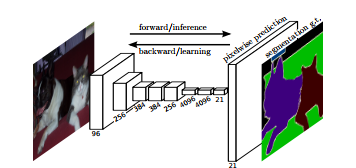

# Semantic Segmentation
### Introduction
In this project, I'll label the pixels of a road in images using a Fully Convolutional Network (FCN).

### Architecture



FCN is composed of 2 types of neural network: Encoder and Decoder.
I used trained VGG16 as Encoder. Decoder network is based on [this](https://people.eecs.berkeley.edu/~jonlong/long_shelhamer_fcn.pdf) paper.

### Hyperparameter
- Optimizer: Adam
- Learning rate: 0.001
- Initializer: tf.truncated_normal_initializer(stddev=0.001)
- Batch size: 6
- Epoch 50

### Result


### Setup
##### Frameworks and Packages
Make sure you have the following is installed:
 - [Python 3](https://www.python.org/)
 - [TensorFlow](https://www.tensorflow.org/)
 - [NumPy](http://www.numpy.org/)
 - [SciPy](https://www.scipy.org/)
##### Dataset
Download the [Kitti Road dataset](http://www.cvlibs.net/datasets/kitti/eval_road.php) from [here](http://www.cvlibs.net/download.php?file=data_road.zip).  Extract the dataset in the `data` folder.  This will create the folder `data_road` with all the training a test images.

### Start
##### Run
Run the following command to run the project:
```
python main.py
```
**Note** If running this in Jupyter Notebook system messages, such as those regarding test status, may appear in the terminal rather than the notebook.

### Submission
1. Ensure you've passed all the unit tests.
2. Ensure you pass all points on [the rubric](https://review.udacity.com/#!/rubrics/989/view).
3. Submit the following in a zip file.
 - `helper.py`
 - `main.py`
 - `project_tests.py`
 - Newest inference images from `runs` folder  (**all images from the most recent run**)

 ## How to write a README
A well written README file can enhance your project and portfolio.  Develop your abilities to create professional README files by completing [this free course](https://www.udacity.com/course/writing-readmes--ud777).
